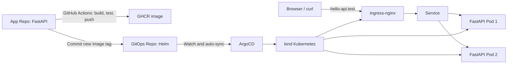

# Hello API GitOps

This repository is the desired-state source for the Hello DevOps API.



## Components

- Helm chart: Deployment, Service, Ingress, and PodDisruptionBudget.
- Deployment: two replicas, resource requests/limits, and startup/liveness/readiness probes. UAT uses zero-unavailable rolling updates; production uses required Pod anti-affinity and topology spread across its two workers, with a one-at-a-time rollout (`maxUnavailable: 1`, `maxSurge: 0`) protected by `PDB minAvailable: 1`.
- ArgoCD Application: watches this repository and reconciles changes into the `hello-api` namespace.

## Local topology

The local proof-of-concept uses two independently managed kind clusters.

```text
kind-devops-demo (production)
├─ control-plane
├─ worker
└─ worker2

kind-devops-uat (UAT)
├─ control-plane
└─ worker
```

- Production ingress: `http://hello-api.test/` (host port `80`)
- UAT ingress: `http://uat.hello-api.test:8082/` (host port `8082`)
- Production Argo CD: `https://localhost:8080`
- UAT Argo CD: `https://localhost:8083`

Add these mappings to the Windows hosts file when you want browser-friendly
hostnames:

```text
127.0.0.1 hello-api.test
127.0.0.1 uat.hello-api.test
```

## Bootstrap and verification

The existing production cluster is created from `kind-config.yaml`. Create a
separate UAT cluster with the additional configuration:

```powershell
kind create cluster --name devops-uat --config kind-config-uat.yaml

helm upgrade --install ingress-nginx ingress-nginx/ingress-nginx `
  --namespace ingress-nginx --create-namespace `
  --kube-context kind-devops-uat `
  --values bootstrap/ingress-nginx-values.yaml --wait

kubectl --context kind-devops-uat create namespace argocd
kubectl --context kind-devops-uat apply --server-side --force-conflicts `
  -n argocd -f https://raw.githubusercontent.com/argoproj/argo-cd/v3.5.1/manifests/install.yaml
kubectl --context kind-devops-uat apply -f argocd/application-uat.yaml
```

Keep each Argo CD Application in its owning cluster:

```powershell
# UAT only
kubectl --context kind-devops-uat apply -f argocd/application-uat.yaml

# Production only
kubectl --context kind-devops-demo apply -f argocd/application.yaml
```

Verify workload health without depending on the Windows hosts mapping:

```powershell
curl.exe -H "Host: uat.hello-api.test" http://127.0.0.1:8082/healthz
curl.exe -H "Host: hello-api.test" http://127.0.0.1/healthz
```

## Implementation note

The cross-repository CI update uses the `GITOPS_REPO_TOKEN` GitHub Actions secret. It should be a fine-grained token limited to `Contents: Read and write` for this GitOps repository.

## Challenge and resolution

The local topology demonstrates Pod-level resilience in UAT and Worker-level placement resilience in production through multiple replicas, readiness gates, a PDB, topology spread, and required Pod anti-affinity. Both kind clusters still use one Docker Desktop host, so physical-host or availability-zone resilience belongs to a production cluster design.
## UAT and production release flow

- UAT Application: `hello-api-uat` in the `hello-api-uat` namespace of
  `kind-devops-uat`, using `chart/values-uat.yaml` and
  `http://uat.hello-api.test:8082/`.
- Production Application: `hello-api` in the `hello-api` namespace of
  `kind-devops-demo`, using `chart/values.yaml` and `http://hello-api.test/`.

1. Push a feature branch: CI runs tests only.
2. In the App Repo Actions page, run "Deploy selected revision to UAT" and enter
   the feature branch, tag, or immutable commit SHA. The workflow tests, builds,
   publishes, and writes that image tag to values-uat.yaml.
3. Argo CD deploys the GitOps commit automatically to UAT.
4. After UAT acceptance, merge the pull request into main.
5. The main CI tests, builds, publishes, and writes the resulting image tag to
   values.yaml. Argo CD then deploys it automatically to production.

The same GitOps repository remains the auditable desired-state source for both
environments. The App Repo uses the GITOPS_REPO_TOKEN secret with Contents:
Read and write permission only for this GitOps repository.
