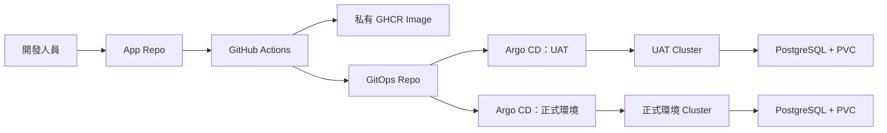

# Hello API GitOps

此 Repository 集中管理 Hello API 的 Kubernetes 部署設定，包括 Helm Chart、UAT／正式環境差異、網路、擴縮、資料庫與 Secret。Argo CD 會依照這些設定，自動同步到對應的 Cluster。

詳細架構圖請見：[系統架構與交付流程](docs/system-overview.md)。

## 這個專案有兩個 Repo

| Repo | 放什麼 |
|---|---|
| [devops-hello-api](https://github.com/imthe71/devops-hello-api) | FastAPI 程式碼、測試、Dockerfile、GitHub Actions。 |
| 本 Repo | Helm Chart、UAT/正式環境設定、Argo CD Application 與維運文件。 |

簡單說：App Repo 負責做出 Image；GitOps Repo 決定哪個 Image 要跑在哪個環境。

## 架構



## 環境

| 環境 | Cluster | Namespace | 網址 | Argo CD |
|---|---|---|---|---|
| UAT | `kind-devops-uat` | `hello-api-uat` | `http://uat.hello-api.test:8082/` | `http://localhost:8083` |
| 正式環境 | `kind-devops-demo` | `hello-api` | `http://hello-api.test/` | `http://localhost:8080` |

UAT 與正式環境是兩個獨立 kind Cluster，各自有 Argo CD 和 Sealed Secrets controller。

## 發版流程

1. 開發人員推送功能 Branch。
2. 手動執行 UAT Workflow，挑選要測的 branch、tag 或 commit SHA。
3. Workflow 跑測試、建置 Image、推送到私有 GHCR，並更新 `values-uat.yaml`。
4. UAT Argo CD 偵測到 Git 變更後自動部署。
5. UAT 驗收完成後，Pull Request 合併至 `main`。
6. 正式環境 Workflow 自動更新 `values.yaml`；正式 Argo CD 自動部署。

Image Tag 使用 commit SHA，不使用會漂移的 `latest`。要回滾時，將 GitOps values 中的 Image Tag 還原即可。

## Helm 管理的資源

- **Deployment**：FastAPI、resource requests/limits、startup/liveness/readiness Probe。
- **Service / Ingress**：叢集內連線與網域路由。
- **HPA / PDB**：預設 2 個 Pod，CPU 70% 時最多擴至 3 個，維護時至少保留 1 個可用 Pod。
- **PostgreSQL StatefulSet / PVC**：資料庫 Pod 重建後仍使用原本的 1Gi 儲存空間。
- **SealedSecret**：Git 只保存密文；Cluster 內才會還原為 Kubernetes Secret。詳細流程見：[Sealed Secrets 加密與使用方式](docs/sealed-secrets.md)。

正式環境另有 topology spread，會盡量將應用程式 Pod 分散到兩個 Worker Node。

## 快速驗證

```powershell
# 看 UAT 資源
kubectl --context kind-devops-uat -n hello-api-uat get deploy,pods,svc,ingress,hpa,pdb,sts,pvc

# 看正式環境資源
kubectl --context kind-devops-demo -n hello-api get deploy,pods,svc,ingress,hpa,pdb,sts,pvc

# 測 UAT API 與資料庫連線
curl.exe -H "Host: uat.hello-api.test" http://127.0.0.1:8082/healthz
curl.exe -H "Host: uat.hello-api.test" http://127.0.0.1:8082/db-status
```

本地網域需要下列 hosts 設定：

```text
127.0.0.1 hello-api.test
127.0.0.1 uat.hello-api.test
```

## 實作過程中的問題

- 私有 GHCR 不允許 Kubernetes 直接拉 Image，因此每個環境各自建立 `ghcr-pull`。這個設定以 SealedSecret 存在 Git，明文不會被提交。
- UAT 與正式環境是兩個獨立 Cluster，SealedSecret 的加密內容不能共用。每個環境都使用自己的 controller 金鑰與 Namespace 設定。

## 注意事項

- UAT 有 1 個 Worker Node，主要用來驗證功能與發版流程；正式環境有 2 個 Worker Node，應用程式 Pod 可以分散部署。UAT 不具備 Worker Node 層級的 HA，正式環境則可承受單一 Worker 的維護或故障。
- 兩個環境目前都只有 1 個 Control Plane，這是本地 kind Demo 的限制。
- 私有 GHCR 的拉取權限與應用程式參數都由 SealedSecret 產生，明文不放進 Git。
- 兩個 kind Cluster 仍共用同一台 Docker Desktop Host；雲端正式環境可再升級為多可用區 Node Pool、受管資料庫與外部 Secret Store。
- 建立 Cluster、Ingress、Metrics Server、Sealed Secrets 的設定檔放在 `kind-config*.yaml` 與 `bootstrap/`。
