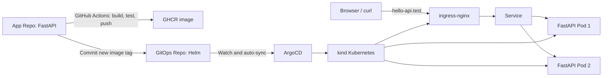

# Hello API GitOps

This repository is the desired-state source for the Hello DevOps API.

## Components

- Helm chart: Deployment, Service, Ingress, and PodDisruptionBudget.
- Deployment: two replicas, resource requests/limits, startup/liveness/readiness probes, and zero-unavailable rolling updates.
- ArgoCD Application: watches this repository and reconciles changes into the `hello-api` namespace.

## Local verification

1. Create kind from `kind-config.yaml`.
2. Install ingress-nginx and ArgoCD.
3. Apply `argocd/application.yaml`.
4. Bind `127.0.0.1 hello-api.test` in Windows hosts.
5. Check `http://hello-api.test/` and `http://hello-api.test/healthz`.

## Implementation note

The cross-repository CI update uses the `GITOPS_REPO_TOKEN` GitHub Actions secret. It should be a fine-grained token limited to `Contents: Read and write` for this GitOps repository.

## Challenge and resolution

A local kind cluster demonstrates Pod-level resilience through multiple replicas, readiness gates, a PDB, and rolling updates. It uses one Docker Desktop host, so physical-host or availability-zone resilience belongs to a production cluster design.
