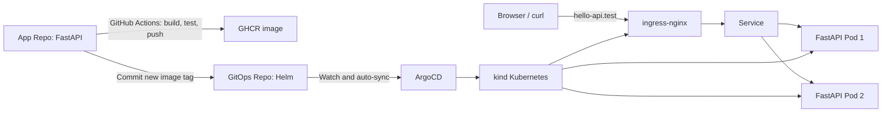

# Hello API GitOps

This repository is the desired-state source for the Hello DevOps API.

## Components

- Helm chart: Deployment, Service, Ingress, and PodDisruptionBudget.
- Deployment: two replicas, resource requests/limits, startup/liveness/readiness probes, and zero-unavailable rolling updates.
- ArgoCD Application: watches this repository and reconciles changes into the `hello-api` namespace.

## Local verification

1. Create kind from `kind-config.yaml`.
2. Install ingress-nginx and ArgoCD.
3. Apply `argocd/application.yaml`.
4. Bind `127.0.0.1 hello-api.test` in Windows hosts.
5. Check `http://hello-api.test/` and `http://hello-api.test/healthz`.

## Implementation note

The cross-repository CI update uses the `GITOPS_REPO_TOKEN` GitHub Actions secret. It should be a fine-grained token limited to `Contents: Read and write` for this GitOps repository.

## Challenge and resolution

A local kind cluster demonstrates Pod-level resilience through multiple replicas, readiness gates, a PDB, and rolling updates. It uses one Docker Desktop host, so physical-host or availability-zone resilience belongs to a production cluster design.

## UAT environment

The hello-api-uat Argo CD Application deploys the same Helm chart to the
hello-api-uat namespace, with an isolated Helm release and ingress hostname:

- URL: http://uat.hello-api.test/
- Argo CD application: hello-api-uat
- overrides: chart/values-uat.yaml

Bootstrap it once after this repository change is available on main:

    kubectl apply -f argocd/application-uat.yaml

## Environment promotion

- chart/values-uat.yaml is the UAT deployment record. App Repo CI updates this
  immutable image tag after tests and an image push.
- chart/values.yaml is the production deployment record. It changes only through
  the GitHub Actions "Promote UAT image to production" workflow.

To promote, open Actions in this GitOps repository, run the promotion workflow,
and enter the exact UAT image tag shown by Argo CD or in values-uat.yaml. The
production Argo CD Application will then reconcile that commit automatically.
