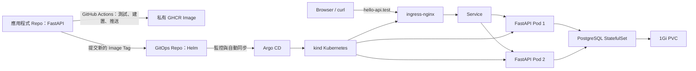

# Hello API GitOps

此 Repository 是 Hello API 的期望狀態（desired state）來源，管理 Kubernetes 應用程式、環境差異與 GitOps 交付設定。

系統架構、交付流程、安全邊界與驗證方式請見：[系統架構與交付流程](docs/system-overview.md)。



## 元件

- Helm Chart：Deployment、Service、Ingress、PodDisruptionBudget、以 CPU 為基礎的 HorizontalPodAutoscaler（HPA）、PostgreSQL StatefulSet/Service/PVC，以及環境專屬 SealedSecret。
- Deployment 與 HPA：預設兩個 Replica，於平均 CPU 使用率 `70%` 時由 `2` 擴展至 `3`。Resource request 提供 HPA 計算基礎；startup/liveness/readiness Probe 提供可用性保護。UAT 使用零不可用的 Rolling Update。正式環境藉由 topology spread 跨兩個 Worker 分散，採逐一更新（`maxUnavailable: 1`、`maxSurge: 0`）並由 `PDB minAvailable: 1` 保護；三個 Replica 時的分布為 `2 + 1`。
- Argo CD Application：監控此 Repository 並將變更收斂至目標 Namespace。它明確忽略由 HPA 控制的 `Deployment.spec.replicas` 差異，因此自動修復不會覆寫擴縮結果。
- Sealed Secrets：每個 Cluster 均執行 `sealed-secrets-controller`。Git 僅保存環境專屬密文；controller 會在 Cluster 內建立 `hello-api-runtime` Kubernetes Secret，供應用程式取得 `APP_DEMO_TOKEN`。

## 本地拓樸

本地驗證環境包含兩個獨立管理的 kind Cluster：

```text
kind-devops-demo（正式環境）
├─ control-plane
├─ worker
└─ worker2

kind-devops-uat（UAT）
├─ control-plane
└─ worker
```

- 正式環境 Ingress：`http://hello-api.test/`（Host port `80`）
- UAT Ingress：`http://uat.hello-api.test:8082/`（Host port `8082`）
- 正式環境 Argo CD：`http://localhost:8080`
- UAT Argo CD：`http://localhost:8083`

若需使用本地網域，請將下列內容加入 Windows hosts 檔：

```text
127.0.0.1 hello-api.test
127.0.0.1 uat.hello-api.test
```

## 初始化與驗證

正式環境 Cluster 由 `kind-config.yaml` 建立；UAT 則使用額外的設定檔：

```powershell
kind create cluster --name devops-uat --config kind-config-uat.yaml

# 在 Argo 套用 Helm Chart 前，於兩個 Cluster 安裝 Sealed Secrets CRD 與 controller。
# 此 script 固定使用 controller release v0.39.1。
.\bootstrap\install-sealed-secrets.ps1

helm upgrade --install ingress-nginx ingress-nginx/ingress-nginx `
  --namespace ingress-nginx --create-namespace `
  --kube-context kind-devops-uat `
  --values bootstrap/ingress-nginx-values.yaml --wait

# 在每個 Cluster 安裝 Metrics Server，供 HPA 與 K9s CPU/MEM 檢視使用。
helm upgrade --install metrics-server metrics-server/metrics-server `
  --namespace kube-system --kube-context kind-devops-uat `
  --values bootstrap/metrics-server-values.yaml --wait
helm upgrade --install metrics-server metrics-server/metrics-server `
  --namespace kube-system --kube-context kind-devops-demo `
  --values bootstrap/metrics-server-values.yaml --wait

kubectl --context kind-devops-uat create namespace argocd
kubectl --context kind-devops-uat apply --server-side --force-conflicts `
  -n argocd -f https://raw.githubusercontent.com/argoproj/argo-cd/v3.5.1/manifests/install.yaml
kubectl --context kind-devops-uat apply -f argocd/application-uat.yaml
```

每個 Argo CD Application 應套用到所屬的 Cluster：

```powershell
# 僅 UAT Cluster
kubectl --context kind-devops-uat apply -f argocd/application-uat.yaml

# 僅正式環境 Cluster
kubectl --context kind-devops-demo apply -f argocd/application.yaml
```

以下指令無須依賴 Windows hosts 對應即可驗證工作負載：

```powershell
curl.exe -H "Host: uat.hello-api.test" http://127.0.0.1:8082/healthz
curl.exe -H "Host: hello-api.test" http://127.0.0.1/healthz

# 觀察任一環境的自動擴縮。
kubectl --context kind-devops-uat -n hello-api-uat get hpa,pods -w
kubectl --context kind-devops-demo -n hello-api get hpa,pods -w
```

## Secret 生命週期

- `chart/values.yaml` 與 `chart/values-uat.yaml` 僅包含加密的 `APP_DEMO_TOKEN`。每段密文皆綁定目標 Cluster 的公鑰、特定 Secret 名稱與 Namespace。
- 明文只會在建立或輪替 Secret 時出現；不得提交 Kubernetes `Secret` manifest、`.env` 或明文 values 檔。
- 若需輪替 Secret，應使用目標 Cluster 的公開憑證透過 `kubeseal` 產生新的 `SealedSecret`，替換相應環境的 `encryptedValue`，再提交 Git 由 Argo CD 同步。由於 Deployment 在 rollout 時仍可取得 Secret reference，輪替會建立新的 Deployment revision。

## 未來 EKS Secret 架構

規劃的 EKS 架構為 AWS Secrets Manager、EKS Pod Identity 與 Secrets Store CSI Driver。Runtime Secret 將以唯讀檔案掛載於 `/mnt/secrets-store`；GitHub Actions Runner 只部署 reference，不讀取 Runtime Secret 值。IAM 邊界、RD 使用規約、輪替、驗證與回滾請見 [`docs/adr/0001-aws-secrets-manager-csi.md`](docs/adr/0001-aws-secrets-manager-csi.md)。

## 實作說明

跨 Repository 的 CI 更新使用 GitHub Actions Secret `GITOPS_REPO_TOKEN`。建議使用 fine-grained token，並僅授與 GitOps Repository 的 `Contents: Read and write` 權限。

## 挑戰與處理方式

本地拓樸透過 UAT 的 Pod 層韌性，以及正式環境跨 Worker 的 placement 韌性，展示兩個基準 Replica、readiness gate、PDB、topology spread 與 HPA。兩個 kind Cluster 仍共用同一個 Docker Desktop Host，因此實體 Host 或 Availability Zone 層級的韌性屬於雲端正式環境設計範圍。

## UAT 與正式環境交付流程

- UAT Application：`kind-devops-uat` 的 `hello-api-uat` Namespace，使用 `chart/values-uat.yaml` 與 `http://uat.hello-api.test:8082/`。
- 正式環境 Application：`kind-devops-demo` 的 `hello-api` Namespace，使用 `chart/values.yaml` 與 `http://hello-api.test/`。

1. 推送功能 Branch：CI 僅執行測試。
2. 在 App Repository 的 Actions 頁面執行 `Deploy selected revision to UAT`，輸入 feature branch、tag 或不可變 commit SHA。Workflow 會測試、建置、推送 Image，並更新 `values-uat.yaml`。
3. Argo CD 自動將 GitOps Commit 部署到 UAT。
4. UAT 驗收完成後，將 Pull Request 合併至 `main`。
5. `main` CI 會測試、建置、推送 Image，並更新 `values.yaml`；Argo CD 隨後自動部署至正式環境。

同一個 GitOps Repository 持續作為兩個環境可稽核的期望狀態來源。App Repository 使用僅具該 GitOps Repository `Contents: Read and write` 權限的 `GITOPS_REPO_TOKEN` Secret。
