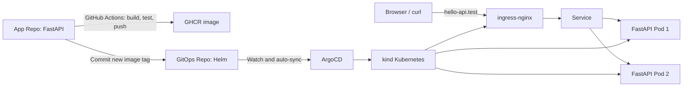

# Hello API GitOps

This repository is the desired-state source for the Hello DevOps API.



## Components

- Helm chart: Deployment, Service, Ingress, PodDisruptionBudget, and a CPU-based HorizontalPodAutoscaler (HPA).
- Deployment and HPA: baseline is two replicas; HPA scales from `2` to `3` at `70%` average CPU utilization. Resource requests provide the utilization baseline, and startup/liveness/readiness probes protect availability. UAT uses zero-unavailable rolling updates. Production uses hard topology spread across its two workers with a one-at-a-time rollout (`maxUnavailable: 1`, `maxSurge: 0`) protected by `PDB minAvailable: 1`; at three replicas it has a balanced `2 + 1` Worker placement.
- Argo CD Application: watches this repository and reconciles changes into its target namespace. It explicitly leaves `Deployment.spec.replicas` to the HPA, so automated self-heal does not reset autoscaled replica counts.
- Sealed Secrets: each Cluster runs a `sealed-secrets-controller`. Git stores only environment-scoped ciphertext; the controller creates the `hello-api-runtime` Kubernetes Secret that supplies `APP_DEMO_TOKEN` to the application.

## Local topology

The local proof-of-concept uses two independently managed kind clusters.

```text
kind-devops-demo (production)
├─ control-plane
├─ worker
└─ worker2

kind-devops-uat (UAT)
├─ control-plane
└─ worker
```

- Production ingress: `http://hello-api.test/` (host port `80`)
- UAT ingress: `http://uat.hello-api.test:8082/` (host port `8082`)
- Production Argo CD: `https://localhost:8080`
- UAT Argo CD: `https://localhost:8083`

Add these mappings to the Windows hosts file when you want browser-friendly
hostnames:

```text
127.0.0.1 hello-api.test
127.0.0.1 uat.hello-api.test
```

## Bootstrap and verification

The existing production cluster is created from `kind-config.yaml`. Create a
separate UAT cluster with the additional configuration:

```powershell
kind create cluster --name devops-uat --config kind-config-uat.yaml

# Install the Sealed Secrets CRD and controller in both clusters before Argo
# applies the Helm chart. The script pins controller release v0.39.1.
.\bootstrap\install-sealed-secrets.ps1

helm upgrade --install ingress-nginx ingress-nginx/ingress-nginx `
  --namespace ingress-nginx --create-namespace `
  --kube-context kind-devops-uat `
  --values bootstrap/ingress-nginx-values.yaml --wait

# Install Metrics Server in each cluster; required by HPA and K9s CPU/MEM views.
helm upgrade --install metrics-server metrics-server/metrics-server `
  --namespace kube-system --kube-context kind-devops-uat `
  --values bootstrap/metrics-server-values.yaml --wait
helm upgrade --install metrics-server metrics-server/metrics-server `
  --namespace kube-system --kube-context kind-devops-demo `
  --values bootstrap/metrics-server-values.yaml --wait

kubectl --context kind-devops-uat create namespace argocd
kubectl --context kind-devops-uat apply --server-side --force-conflicts `
  -n argocd -f https://raw.githubusercontent.com/argoproj/argo-cd/v3.5.1/manifests/install.yaml
kubectl --context kind-devops-uat apply -f argocd/application-uat.yaml
```

Keep each Argo CD Application in its owning cluster:

```powershell
# UAT only
kubectl --context kind-devops-uat apply -f argocd/application-uat.yaml

# Production only
kubectl --context kind-devops-demo apply -f argocd/application.yaml
```

Verify workload health without depending on the Windows hosts mapping:

```powershell
curl.exe -H "Host: uat.hello-api.test" http://127.0.0.1:8082/healthz
curl.exe -H "Host: hello-api.test" http://127.0.0.1/healthz

# Watch autoscaling in either environment.
kubectl --context kind-devops-uat -n hello-api-uat get hpa,pods -w
kubectl --context kind-devops-demo -n hello-api get hpa,pods -w
```

## Secret lifecycle

- `chart/values.yaml` and `chart/values-uat.yaml` contain only encrypted
  `APP_DEMO_TOKEN` values. Each ciphertext is bound to its exact Secret name
  and namespace, and is generated with the public certificate of its owning
  Cluster.
- The plaintext exists only when creating or rotating the Secret; do not commit
  a Kubernetes `Secret` manifest, a `.env` file, or a plaintext values file.
- To rotate a value, generate a new `SealedSecret` with `kubeseal` against the
  target Cluster, replace that environment's `encryptedValue`, commit it, and
  let Argo CD sync. Rotation creates a new Deployment revision because the
  injected Secret reference remains available during the rollout.

## Future EKS secret architecture

The accepted EKS design is AWS Secrets Manager with EKS Pod Identity and the
Secrets Store CSI Driver. Runtime secrets will be mounted as read-only files at
`/mnt/secrets-store`; the GitHub Actions Runner will deploy references only and
will not read runtime secret values. See
[`docs/adr/0001-aws-secrets-manager-csi.md`](docs/adr/0001-aws-secrets-manager-csi.md)
for the IAM boundaries, RD contract, rotation, verification, and rollback plan.

## Implementation note

The cross-repository CI update uses the `GITOPS_REPO_TOKEN` GitHub Actions secret. It should be a fine-grained token limited to `Contents: Read and write` for this GitOps repository.

## Challenge and resolution

The local topology demonstrates Pod-level resilience in UAT and Worker-level placement resilience in production through two baseline replicas, readiness gates, a PDB, topology spread, and HPA. Both kind clusters still use one Docker Desktop host, so physical-host or availability-zone resilience belongs to a production cluster design.
## UAT and production release flow

- UAT Application: `hello-api-uat` in the `hello-api-uat` namespace of
  `kind-devops-uat`, using `chart/values-uat.yaml` and
  `http://uat.hello-api.test:8082/`.
- Production Application: `hello-api` in the `hello-api` namespace of
  `kind-devops-demo`, using `chart/values.yaml` and `http://hello-api.test/`.

1. Push a feature branch: CI runs tests only.
2. In the App Repo Actions page, run "Deploy selected revision to UAT" and enter
   the feature branch, tag, or immutable commit SHA. The workflow tests, builds,
   publishes, and writes that image tag to values-uat.yaml.
3. Argo CD deploys the GitOps commit automatically to UAT.
4. After UAT acceptance, merge the pull request into main.
5. The main CI tests, builds, publishes, and writes the resulting image tag to
   values.yaml. Argo CD then deploys it automatically to production.

The same GitOps repository remains the auditable desired-state source for both
environments. The App Repo uses the GITOPS_REPO_TOKEN secret with Contents:
Read and write permission only for this GitOps repository.
