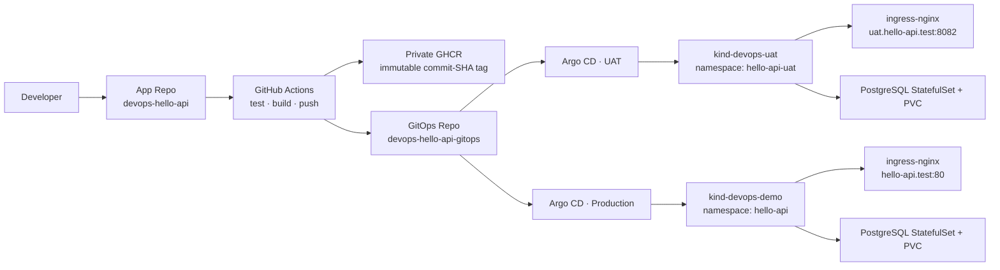

# 面試展示導覽（GitOps DevOps Demo）

> 目標：用兩個 GitHub Repository 展示「程式碼變更如何經 CI、私有 Image Registry、GitOps 與 Argo CD，安全且可追溯地進入 UAT 與正式環境」。

## 1. 先給面試官看的全貌



## 2. 展示順序（8–10 分鐘）

### A. 先看兩個 Repository（約 1 分鐘）

| Repository | 網址 | 角色 |
|---|---|---|
| App Repo | [devops-hello-api](https://github.com/imthe71/devops-hello-api) | FastAPI 原始碼、測試、Dockerfile、CI Workflow |
| GitOps Repo | [devops-hello-api-gitops](https://github.com/imthe71/devops-hello-api-gitops) | Helm desired state、Argo Application、環境差異與基礎元件設定 |

重點說法：**App Repo 管「如何產出 artifact」；GitOps Repo 管「環境應該長什麼樣子」。**

### B. App Repo：程式、測試與 CI（約 2 分鐘）

依序開啟：

1. `app/main.py`
   - `/healthz`：liveness
   - `/readyz`：readiness
   - `/db-status`：只回報 DB 是否已設定、是否可連線，絕不輸出密碼
   - `/notes`：PostgreSQL + PVC 持久化展示 API
2. `tests/test_main.py`：API 行為測試。
3. `Dockerfile`：可重現的 container artifact。
4. `.github/workflows/ci.yml`
   - `main`：test → build → push 私有 GHCR → 更新 GitOps `values.yaml` image tag。
5. `.github/workflows/deploy-uat.yml`
   - 手動輸入 feature branch / tag / commit SHA。
   - test → build → push → 更新 GitOps `values-uat.yaml`。

重點說法：Image 使用 commit SHA tag，不以浮動的 `latest` 作為部署依據；每一版可從 Git commit 與 image tag 反查。

### C. GitOps Repo：Helm desired state（約 2 分鐘）

| 要展示的檔案 | 說明 |
|---|---|
| `chart/values-uat.yaml`、`chart/values.yaml` | UAT 與正式的 host、replica、資源、image tag、HPA 等環境差異 |
| `chart/templates/deployment.yaml` | Deployment、probe、resource requests/limits、rolling update、imagePullSecrets |
| `chart/templates/service.yaml`、`ingress.yaml` | ClusterIP Service 與 Host-based Ingress 路由 |
| `chart/templates/hpa.yaml`、`pdb.yaml` | min 2 / max 3、CPU 70%、`minAvailable: 1` |
| `chart/templates/postgres-statefulset.yaml` | PostgreSQL StatefulSet 與 `volumeClaimTemplates` |
| `chart/templates/postgres-service.yaml` | Headless Service 與 App 使用的 DB Service |
| `chart/templates/*secret.yaml` | SealedSecret；Git 僅保存密文，Cluster 內才還原為 Secret |

重點說法：GitOps Repo 是唯一 desired state；直接 `kubectl edit` 的漂移會被 Argo CD 偵測並收斂。

### D. Argo CD 與環境隔離（約 2 分鐘）

1. 開 UAT Argo CD：`http://localhost:8083`
2. 開正式 Argo CD：`http://localhost:8080`
3. 顯示 Application Tree：Deployment → ReplicaSet → Pod、Service、Ingress、PDB、HPA、PostgreSQL、PVC。
4. 開 `argocd/application-uat.yaml`、`argocd/application.yaml`：
   - 各 Application 指向同一 GitOps Repo、不同 values file。
   - `automated.prune` + `selfHeal` 已啟用。

重點說法：UAT 與正式是**兩個獨立 kind Cluster**，各自有 Argo CD 與 Sealed Secrets controller；密文只能由其所屬 Cluster 解密。

### E. 現場驗證（約 2 分鐘）

```powershell
# UAT：工作負載、網路、HA 與持久化資源
kubectl --context kind-devops-uat -n hello-api-uat get deploy,pods,svc,ingress,hpa,pdb,sts,pvc

# 正式：工作負載、網路、HA 與持久化資源
kubectl --context kind-devops-demo -n hello-api get deploy,pods,svc,ingress,hpa,pdb,sts,pvc

# UAT App 與 DB 狀態
curl.exe -H "Host: uat.hello-api.test" http://127.0.0.1:8082/healthz
curl.exe -H "Host: uat.hello-api.test" http://127.0.0.1:8082/db-status
curl.exe -H "Host: uat.hello-api.test" http://127.0.0.1:8082/notes
```

持久化展示：新增一筆 `/notes` 後，刪除 PostgreSQL Pod；StatefulSet 會重建 Pod，PVC 仍然保留資料。完整步驟見 [`postgresql-pvc.md`](runbooks/postgresql-pvc.md)。

## 3. 發版故事線

```text
Feature branch
  → GitHub Actions「Deploy selected revision to UAT」
  → CI 更新 values-uat.yaml
  → UAT Argo CD 自動 Sync
  → UAT 驗收（API / Argo Tree / K9s）
  → Pull Request merge 到 main
  → main CI 更新 values.yaml
  → Production Argo CD 自動 Sync
```

**UAT 是人工選版、Argo 自動部署；正式是 main merge 後自動交付。**

## 4. 面試官常見提問與回答

| 問題 | 展示重點 |
|---|---|
| 為什麼雙 Repo？ | 分離 application source 與 deployment desired state；權限、審查與回滾界線清晰。 |
| 為什麼 Helm？ | 單一 chart 配合環境 values，減少重複 YAML，同時保留可讀的設定差異。 |
| 如何回滾？ | 將 GitOps Repo 的 image tag revert；Argo CD 會將叢集收斂回該 revision。 |
| 私有 Image 怎麼拉？ | GHCR 私有 package + Cluster 內的 `ghcr-pull` imagePullSecret；Git 中為 SealedSecret 密文。 |
| Secret 為何能進 Git？ | 只提交 SealedSecret ciphertext；每個 Cluster 有不同解密金鑰與 namespace/name scope。 |
| 怎麼做 HA？ | 兩個 baseline replicas、readiness、PDB、HPA；正式環境額外 topology spread 到兩個 worker。 |
| DB 怎麼持久化？ | PostgreSQL StatefulSet 使用 1Gi RWO PVC；Pod 重建仍重新掛載相同 PVC。 |
| 為何不用 Ansible 部署 App？ | Bootstrap 可以自動化；應用程式發版保持 GitOps + Argo CD，避免兩套部署控制平面。 |

## 5. 題目對照

| 題目項目 | 對應實作 |
|---|---|
| Local Kubernetes + Argo CD | `kind-config*.yaml`、`argocd/application*.yaml` |
| 兩個 Repo | App Repo + GitOps Repo |
| CI build / push / update tag | `ci.yml`、`deploy-uat.yml` |
| Helm | `chart/` |
| Deployment / Service / Ingress | `chart/templates/` |
| Argo 監控及同步 | Application `automated` sync policy |
| Probe / resources / replicas | `deployment.yaml`、`hpa.yaml`、`pdb.yaml` |
| 架構、流程、踩坑 | 根目錄 `README.md`、本文件、`docs/` |

## 6. 範圍與下一步

目前的 kind Cluster 共用同一台 Docker Desktop Host，展示的是 Pod、Worker placement、應用層與 GitOps 的韌性；雲端正式環境可再延伸為多可用區 node pool、Cluster Autoscaler、external secrets 與 managed PostgreSQL。

IaC / Ansible 不屬於本題必要交付。若還有時間，建議只加入 **Bootstrap automation**（建立 kind、安裝 ingress-nginx / metrics-server / Sealed Secrets / Argo CD），但 App 部署仍應只由 Argo CD 執行。
