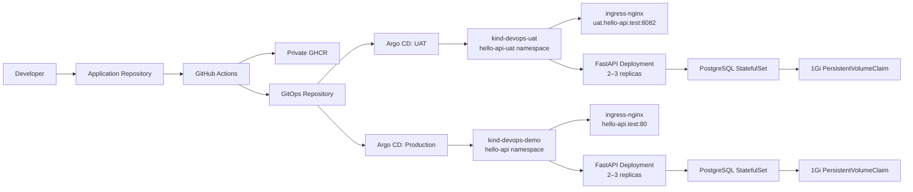
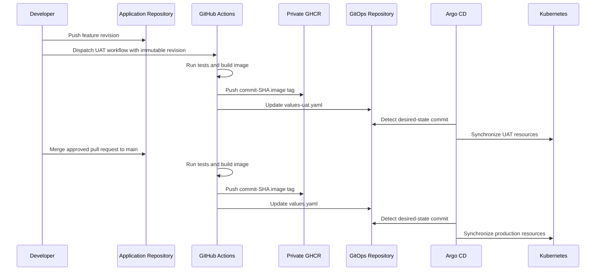

# System Architecture and Delivery Flow

This document describes the architecture, delivery model, security boundaries, and operational verification for the Hello API GitOps implementation.

## Architecture



## Repository boundaries

| Repository | Responsibility |
|---|---|
| [devops-hello-api](https://github.com/imthe71/devops-hello-api) | FastAPI source code, API tests, Dockerfile, and GitHub Actions workflows. |
| [devops-hello-api-gitops](https://github.com/imthe71/devops-hello-api-gitops) | Helm chart, environment values, Argo CD Application declarations, bootstrap configuration, and operational documentation. |

The application repository produces immutable container artifacts. The GitOps repository is the auditable desired-state source for cluster workloads.

## Release model



- **UAT:** a selected branch, tag, or immutable commit SHA is deployed through the manual `Deploy selected revision to UAT` workflow.
- **Production:** a merge to `main` runs the production workflow automatically.
- Every deployment is traceable through the application commit, the GHCR image tag, the GitOps commit, and the Argo CD sync revision.
- Rollback is performed by reverting the image tag in the relevant GitOps values file; Argo CD reconciles the target cluster to that revision.

## Environment topology

| Environment | Cluster | Namespace | Application endpoint | Argo CD endpoint |
|---|---|---|---|---|
| UAT | `kind-devops-uat` | `hello-api-uat` | `http://uat.hello-api.test:8082/` | `http://localhost:8083` |
| Production | `kind-devops-demo` | `hello-api` | `http://hello-api.test/` | `http://localhost:8080` |

The two environments run in independently managed kind clusters. Each cluster has its own Argo CD instance and Sealed Secrets controller, keeping environment reconciliation and decryption scopes separate.

## GitOps components

The Helm chart defines the following resources:

| Component | Purpose |
|---|---|
| Deployment | FastAPI workload, rolling-update policy, probes, resource requests/limits, and GHCR image pull configuration. |
| Service and Ingress | Internal Service discovery and host-based HTTP routing through ingress-nginx. |
| HPA and PDB | Baseline of two application replicas, scale-out to three replicas at 70% CPU utilization, and `minAvailable: 1` disruption protection. |
| PostgreSQL StatefulSet | Stable database identity with a dedicated Service and persistent storage. |
| PersistentVolumeClaim | 1Gi `ReadWriteOnce` storage per environment for PostgreSQL data. |
| SealedSecret | Encrypted Git-stored configuration that is decrypted only in its owning cluster and namespace. |

Production additionally applies topology spread across its two worker nodes. UAT uses the same application-level availability controls on a smaller node topology.

## Secrets and image access

- Container images are hosted in a private GHCR package.
- Each namespace receives a `ghcr-pull` image pull Secret through a cluster-specific SealedSecret.
- Runtime application configuration is injected from `hello-api-runtime` without storing plaintext values in Git.
- PostgreSQL credentials are also rendered from an environment-specific SealedSecret.
- The GitHub Actions cross-repository credential is stored as the `GITOPS_REPO_TOKEN` GitHub Actions secret and is not committed to either repository.

## Data persistence

PostgreSQL is deployed as a single-replica StatefulSet with a `volumeClaimTemplates` entry. The StatefulSet recreates a failed database Pod with the same ordinal identity and reattaches the same PVC, so records survive a Pod restart.

The UAT application revision includes `/db-status` and `/notes` endpoints to verify database connectivity and persistence without exposing credentials. The detailed persistence test procedure is in [the PostgreSQL PVC runbook](runbooks/postgresql-pvc.md).

## Verification

```powershell
# UAT resources
kubectl --context kind-devops-uat -n hello-api-uat get deploy,pods,svc,ingress,hpa,pdb,sts,pvc

# Production resources
kubectl --context kind-devops-demo -n hello-api get deploy,pods,svc,ingress,hpa,pdb,sts,pvc

# UAT application and PostgreSQL connectivity
curl.exe -H "Host: uat.hello-api.test" http://127.0.0.1:8082/healthz
curl.exe -H "Host: uat.hello-api.test" http://127.0.0.1:8082/db-status
curl.exe -H "Host: uat.hello-api.test" http://127.0.0.1:8082/notes
```

## Local-environment scope

The local implementation demonstrates GitOps reconciliation, workload availability, environment separation, private registry access, encrypted configuration, and persistent storage. Both kind clusters share one Docker Desktop host; cloud production deployment can extend this model with multi-zone node pools, Cluster Autoscaler, managed PostgreSQL, and an external secret store.
