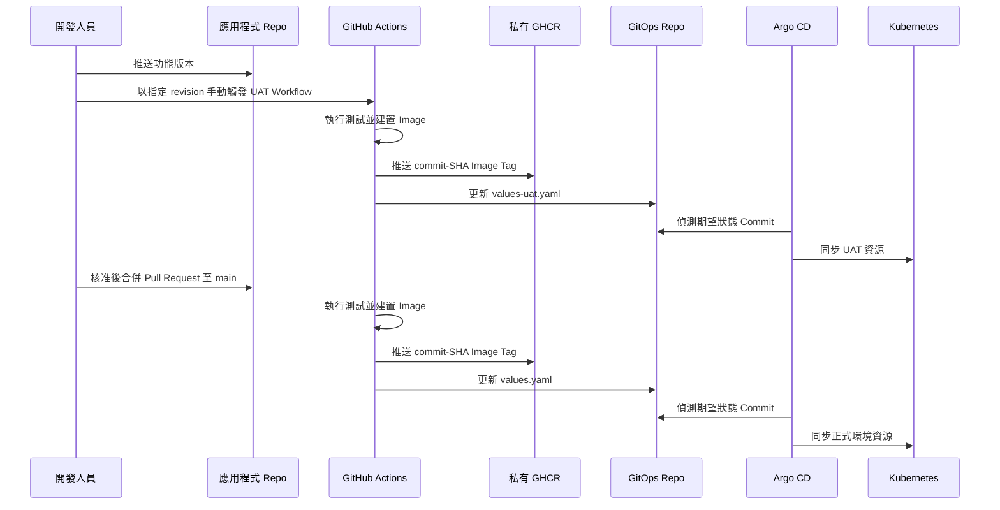

# 系統架構與交付流程

本文說明 Hello API GitOps 專案的系統架構、交付模型、安全邊界與驗證方式。

## 系統架構


## Repository 職責邊界

| Repository | 職責 |
|---|---|
| [devops-hello-api](https://github.com/imthe71/devops-hello-api) | FastAPI 原始碼、API 測試、Dockerfile 與 GitHub Actions Workflow。 |
| [devops-hello-api-gitops](https://github.com/imthe71/devops-hello-api-gitops) | Helm Chart、環境 values、Argo CD Application 宣告、Bootstrap 設定與維運文件。 |

應用程式 Repository 負責產出不可變的容器 artifact；GitOps Repository 則是叢集工作負載唯一、可稽核的期望狀態來源。

## 發版模型



- **UAT：**透過手動的 `Deploy selected revision to UAT` Workflow，選擇 branch、tag 或不可變的 commit SHA。
- **正式環境：**Pull Request 合併至 `main` 後，自動執行正式環境 Workflow。
- 每次部署均可由應用程式 commit、GHCR image tag、GitOps commit 與 Argo CD sync revision 交叉追溯。
- 回滾時，只需還原相應 GitOps values 檔中的 image tag；Argo CD 會將目標 Cluster 收斂回該 revision。

## 環境拓樸

| 環境 | Cluster | Namespace | 應用程式網址 | Argo CD 管理網址 |
|---|---|---|---|---|
| UAT | `kind-devops-uat` | `hello-api-uat` | `http://uat.hello-api.test:8082/` | `http://localhost:8083` |
| 正式環境 | `kind-devops-demo` | `hello-api` | `http://hello-api.test/` | `http://localhost:8080` |

兩個環境使用獨立管理的 kind Cluster。每個 Cluster 各自擁有 Argo CD 與 Sealed Secrets controller，因此同步與解密範圍彼此隔離。

## GitOps 元件

Helm Chart 定義下列資源：

| 元件 | 用途 |
|---|---|
| Deployment | FastAPI 工作負載、Rolling Update 策略、Probe、資源 requests/limits 與 GHCR image pull 設定。 |
| Service 與 Ingress | 叢集內服務發現，以及經 ingress-nginx 的 Host-based HTTP 路由。 |
| HPA 與 PDB | 預設兩個應用程式 Replica、CPU 70% 時擴展至三個 Replica，以及 `minAvailable: 1` 的維護保護。 |
| PostgreSQL StatefulSet | 具穩定識別的資料庫工作負載，以及專屬 Service 與持久化儲存。 |
| PersistentVolumeClaim | 每個環境各自使用 1Gi `ReadWriteOnce` 儲存空間保存 PostgreSQL 資料。 |
| SealedSecret | 以密文儲存於 Git，僅能由目標 Cluster 與 Namespace 中的 controller 解密。 |

正式環境額外套用 topology spread，將應用程式分散至兩個 Worker Node；UAT 則以較小的 Node 拓樸保留相同的應用程式可用性控制。

## Secret 與 Image 存取

- Container Image 儲存於私有 GHCR Package。
- 每個 Namespace 透過 Cluster 專屬的 SealedSecret 取得 `ghcr-pull` imagePullSecret。
- Runtime application configuration 由 `hello-api-runtime` 注入，Git 不保存明文。
- PostgreSQL credential 同樣由環境專屬的 SealedSecret 產生。
- 跨 Repository 的 GitHub Actions credential 儲存為 `GITOPS_REPO_TOKEN` GitHub Actions Secret，不提交至任一 Repository。

## 資料持久化

PostgreSQL 以單一 Replica 的 StatefulSet 部署，並透過 `volumeClaimTemplates` 建立 PersistentVolumeClaim。資料庫 Pod 發生故障時，StatefulSet 會以相同 ordinal 重建 Pod，並重新掛載原本的 PVC，因此資料可跨 Pod 重建保留。

UAT 的應用程式版本提供 `/db-status` 與 `/notes` API，用於驗證資料庫連線與持久化，但不會回傳 credential。完整測試步驟請見 [PostgreSQL PVC 維運手冊](runbooks/postgresql-pvc.md)。

## 驗證方式

```powershell
# UAT 資源
kubectl --context kind-devops-uat -n hello-api-uat get deploy,pods,svc,ingress,hpa,pdb,sts,pvc

# 正式環境資源
kubectl --context kind-devops-demo -n hello-api get deploy,pods,svc,ingress,hpa,pdb,sts,pvc

# UAT 應用程式與 PostgreSQL 連線
curl.exe -H "Host: uat.hello-api.test" http://127.0.0.1:8082/healthz
curl.exe -H "Host: uat.hello-api.test" http://127.0.0.1:8082/db-status
curl.exe -H "Host: uat.hello-api.test" http://127.0.0.1:8082/notes
```

## 本地環境範圍

本地實作展示 GitOps 收斂、工作負載可用性、環境隔離、私有 Registry 存取、加密設定與持久化儲存。兩個 kind Cluster 共用同一台 Docker Desktop Host；雲端正式環境可延伸為多可用區 Node Pool、Cluster Autoscaler、受管 PostgreSQL 與外部 Secret Store。
