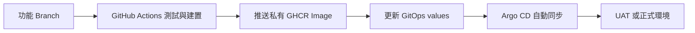

# 系統架構與交付流程

## 一句話說明

程式碼在 App Repo；Kubernetes 設定在 GitOps Repo；GitHub Actions 更新 Image Tag；Argo CD 看到 Git 變更後自動部署。

## 流程圖



## UAT 與正式環境

| 階段 | 做法 |
|---|---|
| UAT | 手動選擇要測的 branch、tag 或 commit SHA；Workflow 更新 `values-uat.yaml`，Argo CD 自動部署。 |
| 正式環境 | UAT 驗收後合併至 `main`；Workflow 更新 `values.yaml`，Argo CD 自動部署。 |

兩個環境在不同 Cluster 與 Namespace 中運行，因此部署、Argo CD 與 Secret 解密彼此分開。

## 主要設計

- **可追溯**：Image 使用 commit SHA tag，可從部署版本回查程式碼與 GitOps Commit。
- **可回滾**：還原 GitOps values 的 Image Tag，Argo CD 會自動回到舊版本。
- **可用性**：兩個 App Pod 起跳，HPA 最多 3 個、PDB 至少保留 1 個，並配置健康檢查。
- **資料持久化**：PostgreSQL StatefulSet 使用 1Gi PVC；Pod 重建後資料仍保留。
- **Secret 安全**：Git 只放 SealedSecret 密文；私有 GHCR 與資料庫參數在 Cluster 內還原。

## 驗證

```powershell
kubectl --context kind-devops-uat -n hello-api-uat get deploy,pods,svc,ingress,hpa,pdb,sts,pvc
curl.exe -H "Host: uat.hello-api.test" http://127.0.0.1:8082/healthz
curl.exe -H "Host: uat.hello-api.test" http://127.0.0.1:8082/db-status
```

完整的 PostgreSQL/PVC 測試步驟請見 [PostgreSQL PVC 維運手冊](runbooks/postgresql-pvc.md)。

## 本地環境範圍

這是本地 kind 展示環境，兩個 Cluster 共用 Docker Desktop Host。若移至雲端，可延伸為多可用區 Node Pool、受管 PostgreSQL 與外部 Secret Store。
